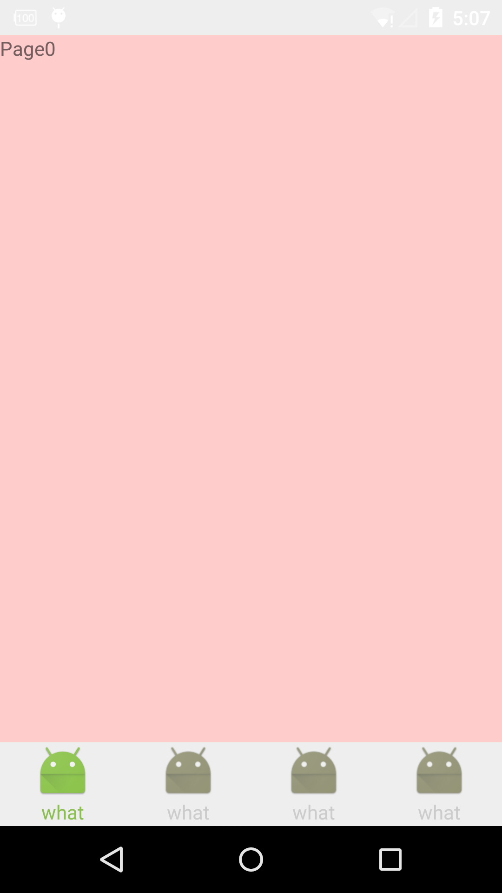

##ViewPagerTable介绍:
*1只需2步完成app的主页面分页，支持任意个数的页面，配置底部按钮图片，动画等等 
*2极大的简化了大家配置TableHost等分页的繁琐代码，而且本框架可以使用其他图片框架display底部导航图片（方便自己配置皮肤什么的） 
*3动画-底部导航器默认有透明度渐变动画和（TextView）颜色渐变动画 
*4继承安卓基础控件开发，兼容性好 
[点击下载aar文件,eclipse要解压,AndroidStudio直接导入aar](https://github.com/zhuxiujia/ViewPagerTable/blob/master/viewpagertable-release.aar?raw=true)

##如何使用?（具体请下载demo和库）: 

###Step1:/*配置xml布局内容*/
                 <com.cry.viewpagertable.ViewPagerTable
                         android:id="@+id/tablehost"
                        />
                     <com.cry.viewpagertable.ViewPagerTableBottomGroup
                         android:id="@+id/button_group"
                     >
                         <com.cry.viewpagertable.ViewPagerTableItem
                             xmlns:ViewPagerTableItem="http://schemas.android.com/apk/res-auto"             
                              ViewPagerTableItem:imageview_up_id="@+id/imageView_up"<!-- 指定Item的抬起ImageView id --!>
                                  ViewPagerTableItem:imageview_down_id="@+id/imageView_down"<!-- 指定Item的按下ImageView id --!>
                                  ViewPagerTableItem:textview_up_id="@+id/textView_up"<!-- 指定Item抬起的TextView id --!>
                                  ViewPagerTableItem:textview_down_id="@+id/textView_down"<!-- 指定Item按下的TextView id --!>
                             >
                              <FrameLayout
                                     android:id="@+id/frame"
                                     android:layout_width="40dp"
                                     android:layout_height="40dp"
                                     android:layout_centerHorizontal="true">
                                     <ImageView
                                         android:layout_width="wrap_content"
                                         android:layout_height="wrap_content"
                                         android:src="@mipmap/ic_launcher"
                                         android:id="@+id/imageView_up"
                                         />
                                     <ImageView
                                         android:layout_width="wrap_content"
                                         android:layout_height="wrap_content"
                                         android:src="@mipmap/ic_launcher"
                                         android:id="@+id/imageView_down"
                                         />
                                 </FrameLayout>
                                 <RelativeLayout
                                     android:layout_width="wrap_content"
                                     android:layout_height="wrap_content"
                                     android:layout_centerHorizontal="true"
                                     android:layout_below="@+id/frame">
                                     <TextView
                                         android:id="@+id/textView_up"
                                         android:layout_width="wrap_content"
                                         android:layout_height="wrap_content"
                                         android:layout_centerInParent="true"
                                         android:text="up" />
                                     <TextView
                                         android:id="@+id/textView_down"
                                         android:layout_width="wrap_content"
                                         android:layout_height="wrap_content"
                                         android:layout_centerInParent="true"
                                         android:textColor="#ff8888"
                                         android:text="down"
                                         />
                                 </RelativeLayout>
                         </com.cry.viewpagertable.ViewPagerTableItem>
                         .
                         .
                         ...等等...

###Step2:            /*初始化控件*/
                  table_bottom_group =(ViewPagerTableBottomGroup)findViewById(R.id.button_group);//底部选择器
                  tableHost=(ViewPagerTable)findViewById(R.id.tablehost);//内容ViewPager
                  /*设置ViewPager4个内容页面（个数任意），*/
                  View root0= LayoutInflater.from(this).inflate(R.layout.root0,null);
                          View root1= LayoutInflater.from(this).inflate(R.layout.root1,null);
                          View root2= LayoutInflater.from(this).inflate(R.layout.root2,null);
                          View root3= LayoutInflater.from(this).inflate(R.layout.root3,null);
                          List<View> views=new ArrayList<>();
                          views.add(root0);
                          views.add(root1);
                          views.add(root2);
                          views.add(root3);
                          tableHost.setViewLayout(views);
                  /*底部选择器选择状态改变侦听*/
                  table_bottom_group.setOnViewPagerTableGroupChangeListener(new ViewPagerTableBottomGroup.OnViewPagerTableGroupChangeListener() {
                      @Override
                      public void onGroupChange(int index) {
                          tableHost.setCurrentItem(index);//设置ViewPager页面切换
                      }
                  });
                  /*ViewPager页面切换事件侦听*/
                  tableHost.setOnPageChangeListener(new ViewPager.OnPageChangeListener() {
                      @Override
                      public void onPageScrolled(int position, float positionOffset, int positionOffsetPixels) {
          
                      }
          
                      @Override
                      public void onPageSelected(int position) {
                           table_bottom_group.setChildChecked(position);
                      }
          
                      @Override
                      public void onPageScrollStateChanged(int state) {
          
                      }
                  });
         
                   